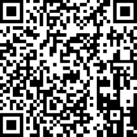

# Flagfilter
Flagfilter is a quick and easy to use site for finding what flag you are looking for. Search for name, color, pattern or a combination.

## Languages
HTML, CSS and JavaScript. As pure as can be, exceptions can be made for jQuery.

## Imported resources
Using flagpedia.net as source for flag images.

## Support
 

If you wish to support my work :coffee:, please find my eth wallet address below or scan the qr code:
`0xfe963F3d5346cEdC24A92BF217745Ea9c4854C17`
